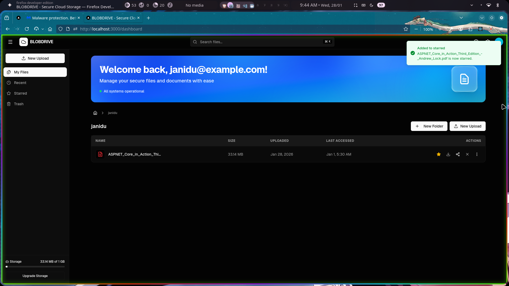
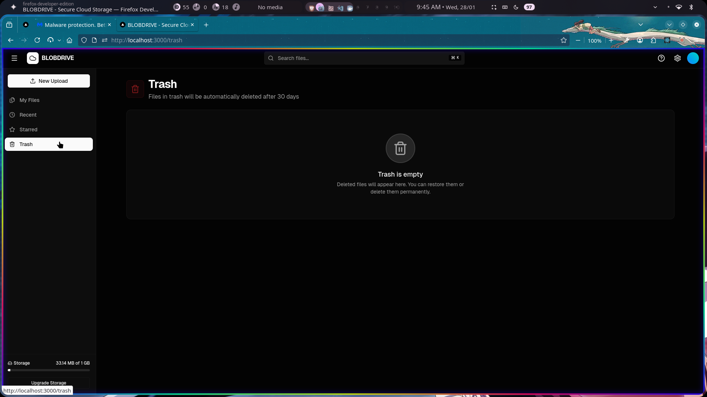
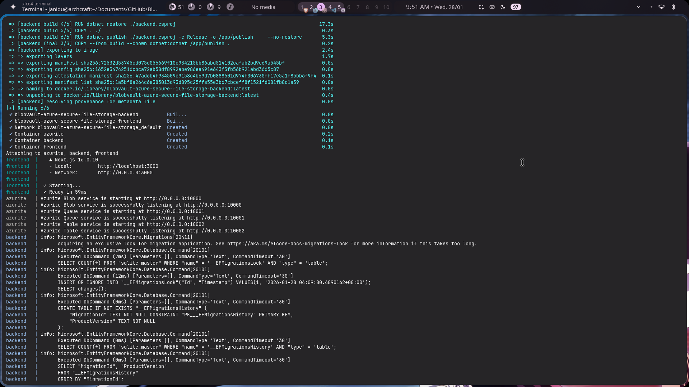

# 🗄️ BlobVault - Azure Secure File Storage

Modern cloud file workflow system using **Next.js** and **.NET** with **Azure Blob Storage**, featuring secure uploads, controlled sharing via SAS tokens, and automated file lifecycle management.


---

## 📷 Screenshots

<table>
  <tr>
    <td></td>
  </tr>
  <tr>
    <td></td>
  </tr>
  <tr>
    <td></td>
  </tr>
  <tr>
    <td></td>
  </tr>
  <tr>
    <td></td>
  </tr>
  <tr>
    <td></td>
  </tr>
  <tr>
    <td></td>
  </tr>
  <tr>
    <td></td>
  </tr>
</table>

---

## 📋 Table of Contents

- [Features](#-features)
- [Architecture](#-architecture)
- [Tech Stack](#-tech-stack)
- [Prerequisites](#-prerequisites)
- [Getting Started](#-getting-started)
- [Configuration](#-configuration)
- [Project Structure](#-project-structure)
- [API Documentation](#-api-documentation)
- [Blob Storage Integration Test (Manual)](#-blob-storage-integration-test-manual)
- [Background Services](#-background-services)
- [Security Features](#-security-features)
- [Contributing](#-contributing)
- [License](#-license)

---

## ✨ Features

### 🔐 Security

- **JWT Authentication** - Secure user authentication and authorization
- **SAS Token Generation** - Time-limited, secure file sharing
- **User Isolation** - Files organized by user with access control
- **HTTPS Only** - Encrypted data transmission

### 📁 File Management

- **Secure Upload** - Direct upload to Azure Blob Storage
- **File Download** - Secure download with authentication
- **File Deletion** - User-controlled file deletion
- **File Listing** - View all user files with metadata

### 🤖 Automated Lifecycle Management

- **Auto-Archiving** - Files automatically archived after 90 days
- **Auto-Deletion** - Files permanently deleted after 180 days
- **Background Processing** - Runs cleanup tasks every 24 hours
- **Configurable Retention** - Easily adjust retention policies

### 🎨 Modern UI

- **Responsive Design** - Works on desktop and mobile
- **Drag & Drop Upload** - Intuitive file upload experience
- **Real-time Updates** - Instant feedback using React Query
- **Toast Notifications** - User-friendly notifications with Sonner

---

## 🏗️ Architecture

```
┌─────────────┐         ┌─────────────┐         ┌─────────────┐
│             │         │             │         │             │
│  Next.js    │◄───────►│  .NET API   │◄───────►│   Azure     │
│  Frontend   │  HTTP   │  Backend    │  SDK    │   Blob      │
│             │  JWT    │             │         │  Storage    │
└─────────────┘         └─────────────┘         └─────────────┘
                              │
                              ▼
                        ┌─────────────┐
                        │  EF Core    │
                        │  In-Memory  │
                        │  Database   │
                        └─────────────┘
```

### Components

1. **Frontend (Next.js)**

   - User authentication UI
   - File upload/download interface
   - Dashboard with file management
   - Responsive design with Tailwind CSS

2. **Backend (.NET 9)**

   - RESTful API with JWT authentication
   - Azure Blob Storage integration
   - Entity Framework Core for data management
   - Background services for lifecycle management

3. **Storage (Azure Blob)**
   - Main container for active files
   - Archive container for old files
   - SAS token-based access control

---

## 🛠️ Tech Stack

### Backend

- **.NET 9.0** - Modern, high-performance framework
- **ASP.NET Core** - Web API framework
- **Entity Framework Core** - ORM with In-Memory database
- **Azure.Storage.Blobs** - Azure Blob Storage SDK
- **JWT Bearer Authentication** - Secure token-based auth
- **Swagger/OpenAPI** - API documentation

### Frontend

- **Next.js 16** - React framework with App Router
- **React 19** - Latest React features
- **TypeScript** - Type-safe JavaScript
- **Tailwind CSS** - Utility-first CSS framework
- **Axios** - HTTP client
- **React Query** - Data fetching and caching
- **React Dropzone** - Drag & drop file upload
- **Lucide React** - Icon library
- **Sonner** - Toast notifications

---

## 📦 Prerequisites

Before you begin, ensure you have the following installed:

- **.NET 9.0 SDK** - [Download](https://dotnet.microsoft.com/download)
- **Node.js 20+** - [Download](https://nodejs.org/)
- **Azure Account** - [Create free account](https://azure.microsoft.com/free/)
- **Azure Storage Account** - For Blob Storage
- **Git** - For version control

---

## 🚀 Getting Started

### 1. Clone the Repository

```bash
git clone https://github.com/JaniduP2003/BlobVault-azure-secure-file-storage.git
cd BlobVault-azure-secure-file-storage
```

### 2. Backend Setup

#### Navigate to backend directory

```bash
cd backend
```

#### Restore dependencies

```bash
dotnet restore
```

#### Configure Azure Storage

Edit `appsettings.json` or `appsettings.Development.json`:

```json
{
  "AzureStorage": {
    "ConnectionString": "YOUR_AZURE_STORAGE_CONNECTION_STRING",
    "ContainerName": "userfiles"
  },
  "Jwt": {
    "Key": "YOUR_SECRET_KEY_AT_LEAST_32_CHARACTERS_LONG",
    "Issuer": "SecureDocumentApi",
    "Audience": "SecureDocumentClient",
    "ExpiryInMinutes": 1440
  },
  "FileRetention": {
    "ArchiveAfterDays": 90,
    "DeleteAfterDays": 180
  }
}
```

#### Run the backend

```bash
dotnet run
```

Backend will start at `https://localhost:5001` (or check terminal output)

### 3. Frontend Setup

#### Navigate to frontend directory

```bash
cd ../frontend
```

#### Install dependencies

```bash
npm install
```

#### Configure API endpoint

Create `.env.local` file:

```env
NEXT_PUBLIC_API_URL=https://localhost:5001
```

#### Run the frontend

```bash
npm run dev
```

Frontend will start at `http://localhost:3000`

### 4. Access the Application

Open your browser and navigate to:

- **Frontend**: http://localhost:3000
- **API Swagger**: https://localhost:5001/swagger

---

## ⚙️ Configuration

### Backend Configuration

#### appsettings.json

```json
{
  "AzureStorage": {
    "ConnectionString": "Connection string from Azure Portal",
    "ContainerName": "userfiles"
  },
  "Jwt": {
    "Key": "Secret key for JWT signing",
    "Issuer": "API issuer name",
    "Audience": "API audience name",
    "ExpiryInMinutes": 1440
  },
  "FileRetention": {
    "ArchiveAfterDays": 90,
    "DeleteAfterDays": 180
  }
}
```

#### Getting Azure Storage Connection String

1. Go to [Azure Portal](https://portal.azure.com)
2. Navigate to your Storage Account
3. Go to **Access Keys** under **Security + networking**
4. Copy the **Connection String**

### Frontend Configuration

#### .env.local

```env
NEXT_PUBLIC_API_URL=https://localhost:5001
```

---

## 📂 Project Structure

```
BlobVault-azure-secure-file-storage/
├── backend/                          # .NET Backend
│   ├── Controllers/                  # API Controllers
│   │   ├── AuthController.cs        # Authentication endpoints
│   │   └── DocumentsController.cs   # File management endpoints
│   ├── Data/                        # Database context
│   │   └── AppDbContext.cs          # EF Core context
│   ├── Models/                      # Data models
│   │   ├── User.cs                  # User entity
│   │   ├── FileMetadata.cs          # File metadata entity
│   │   ├── LoginRequest.cs          # Login DTO
│   │   └── RegisterRequest.cs       # Register DTO
│   ├── Services/                    # Business logic
│   │   ├── IBlobService.cs          # Blob service interface
│   │   ├── BlobService.cs           # Azure Blob implementation
│   │   └── CleanupService.cs        # Background cleanup service
│   ├── Program.cs                   # Application entry point
│   ├── appsettings.json             # Configuration
│   └── backend.csproj               # Project file
│
├── frontend/                         # Next.js Frontend
│   ├── src/
│   │   ├── app/                     # App Router pages
│   │   │   ├── login/               # Login page
│   │   │   ├── register/            # Register page
│   │   │   └── dashboard/           # Dashboard page
│   │   ├── components/              # React components
│   │   │   ├── Navbar.tsx           # Navigation bar
│   │   │   ├── FileUpload.tsx       # File upload component
│   │   │   ├── FileList.tsx         # File list component
│   │   │   └── ShareModal.tsx       # Share modal component
│   │   ├── lib/                     # Utilities
│   │   │   ├── api.ts               # API client
│   │   │   └── auth.ts              # Auth utilities
│   │   └── types/                   # TypeScript types
│   │       └── index.ts             # Type definitions
│   ├── package.json                 # Dependencies
│   └── next.config.ts               # Next.js config
│
└── README.md                         # This file
```

---

## 📚 API Documentation

### Authentication Endpoints

#### Register User

```http
POST /api/auth/register
Content-Type: application/json

{
  "username": "string",
  "email": "string",
  "password": "string"
}
```

#### Login

```http
POST /api/auth/login
Content-Type: application/json

{
  "email": "string",
  "password": "string"
}

Response:
{
  "token": "jwt_token",
  "username": "string",
  "email": "string"
}
```

### Document Endpoints

All document endpoints require JWT authentication:

```http
Authorization: Bearer {token}
```

#### Upload File

```http
POST /api/documents/upload
Content-Type: multipart/form-data

file: [binary]
```

#### List Files

```http
GET /api/documents
```

#### Download File

```http
GET /api/documents/{id}/download
```

#### Delete File

```http
DELETE /api/documents/{id}
```

#### Generate Share Link

```http
POST /api/documents/{id}/share
Content-Type: application/json

{
  "expiryHours": 24
}

Response:
{
  "shareUrl": "https://...",
  "expiresAt": "2025-12-24T00:00:00Z"
}
```

---

## 🧪 Blob Storage Integration Test (Manual)

Follow these steps to verify your backend, Azurite, and blob storage integration:

### 1. Register a User

```bash
curl -X POST http://localhost:8080/api/auth/register \
  -H "Content-Type: application/json" \
  -d '{"username":"testuser","email":"testuser@example.com","password":"Password123!"}'
```

- Save the `token` from the response.

### 2. Upload a File

```bash
curl -X POST http://localhost:8080/api/documents/upload \
  -H "Authorization: Bearer <TOKEN>" \
  -F "file=@<PATH_TO_FILE>"
```

- Replace `<TOKEN>` with your JWT and `<PATH_TO_FILE>` with a real file path.

### 3. List Files

```bash
curl -X GET http://localhost:8080/api/documents \
  -H "Authorization: Bearer <TOKEN>"
```

- You should see your uploaded file in the response.

### 4. Download a File

```bash
curl -X GET "http://localhost:8080/api/documents/download?blobName=<BLOB_NAME>" \
  -H "Authorization: Bearer <TOKEN>" -o downloaded_file
```

- Replace `<BLOB_NAME>` with the name from the list response.

### 5. (Optional) Check Azurite Data

- Inspect the `azurite/` folder in your project root. You should see new files in `__blobstorage__` after upload.

If all steps succeed, your blob storage integration is working!

---

## 🤖 Background Services

### CleanupService

The `CleanupService` is a background service that runs automatically every 24 hours to manage file lifecycle.

#### Features:

- **Auto-Archiving**: Moves files older than 90 days to archive container
- **Auto-Deletion**: Permanently deletes files older than 180 days
- **Logging**: Comprehensive logging for monitoring
- **Error Handling**: Resilient error handling to prevent crashes

#### Configuration:

```json
{
  "FileRetention": {
    "ArchiveAfterDays": 90,
    "DeleteAfterDays": 180
  }
}
```

#### How it works:

1. Runs every 24 hours (configurable)
2. Scans database for files past retention dates
3. Archives old files to `{container}-archive`
4. Deletes very old files from storage
5. Updates database metadata
6. Logs results for monitoring

---

## 🔒 Security Features

### Authentication & Authorization

- **JWT Tokens**: Secure, stateless authentication
- **Password Hashing**: Passwords hashed before storage
- **Token Expiry**: Configurable token lifetime
- **Bearer Token**: Industry-standard authorization

### File Security

- **User Isolation**: Files organized by user ID
- **Access Control**: Users can only access their own files
- **SAS Tokens**: Time-limited, revocable file access
- **HTTPS**: Encrypted data transmission

### CORS Configuration

```csharp
builder.Services.AddCors(options => {
    options.AddPolicy("AllowFrontend", policy => {
        policy.WithOrigins("http://localhost:3000")
              .AllowAnyMethod()
              .AllowAnyHeader()
              .AllowCredentials();
    });
});
```

---

## 🧪 Testing

### Backend Testing

```bash
cd backend
dotnet test
```

### Frontend Testing

```bash
cd frontend
npm run test
```

### API Testing

Use the Swagger UI at `https://localhost:5001/swagger` to test API endpoints interactively.

---

## 🚀 Deployment

### Backend Deployment (Azure App Service)

```bash
cd backend
dotnet publish -c Release
# Deploy to Azure App Service
```

### Frontend Deployment (Vercel)

```bash
cd frontend
npm run build
# Deploy to Vercel
```

---

## 🤝 Contributing

Contributions are welcome! Please follow these steps:

1. Fork the repository
2. Create a feature branch (`git checkout -b feature/AmazingFeature`)
3. Commit your changes (`git commit -m 'Add some AmazingFeature'`)
4. Push to the branch (`git push origin feature/AmazingFeature`)
5. Open a Pull Request

---

## 📝 License

This project is licensed under the MIT License - see the [LICENSE](LICENSE) file for details.

---

## 👤 Author

**Janidu Perera**

- GitHub: [@JaniduP2003](https://github.com/JaniduP2003)
- Repository: [BlobVault-azure-secure-file-storage](https://github.com/JaniduP2003/BlobVault-azure-secure-file-storage)

---

## 🙏 Acknowledgments

- Azure Blob Storage for reliable cloud storage
- Next.js team for the amazing React framework
- .NET team for the powerful backend framework
- All contributors and users of this project

---

## 📧 Support

For support, email or open an issue in the GitHub repository.

---

<div align="center">
  <p>Made with ❤️ by Janidu Perera</p>
  <p>⭐ Star this repository if you find it helpful!</p>
</div>
